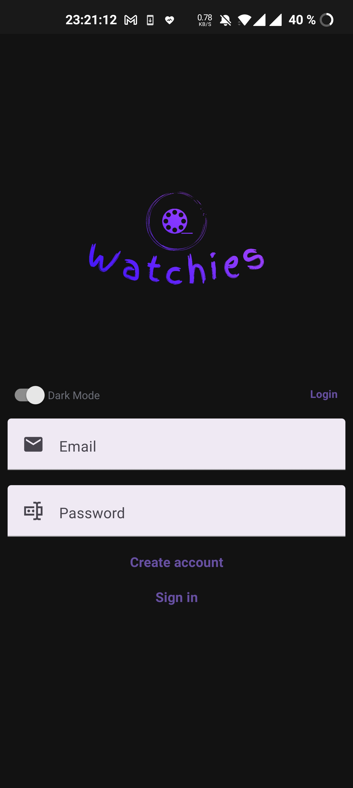
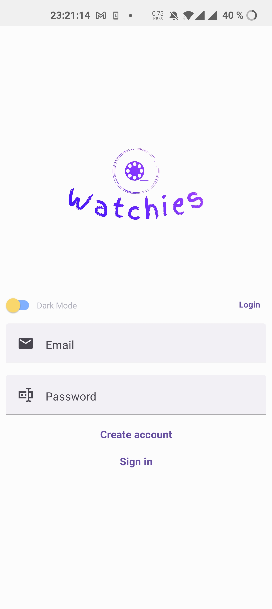
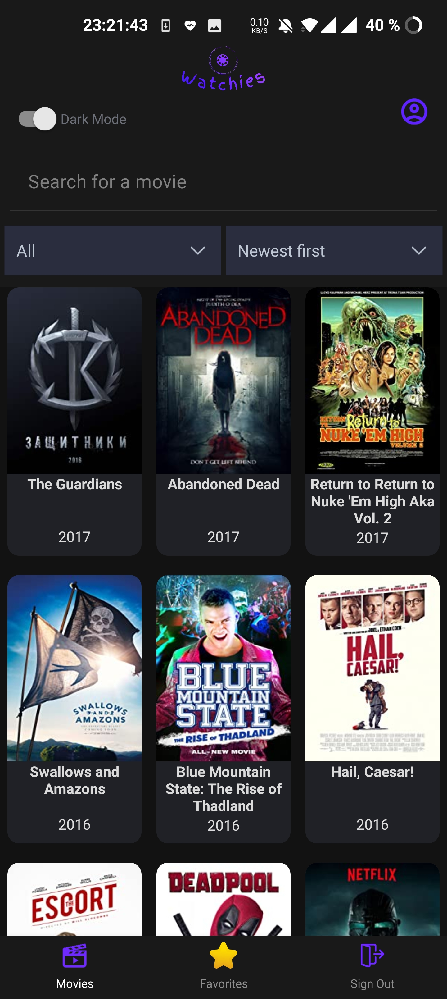
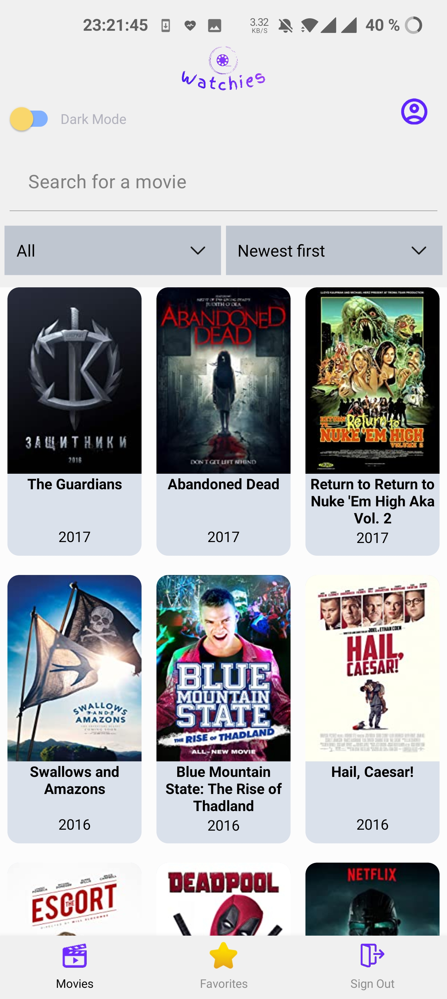
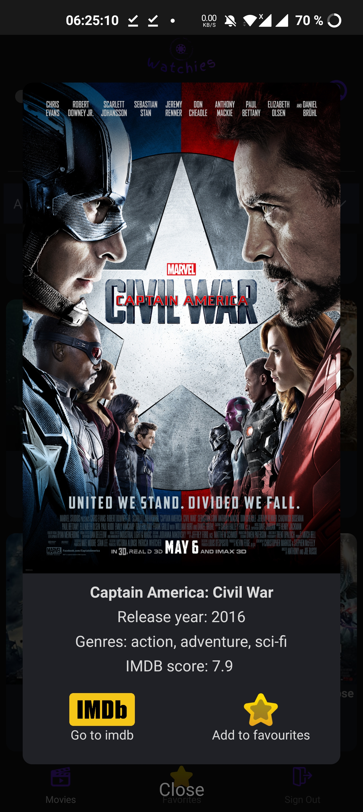
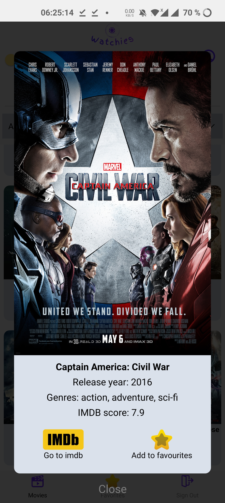
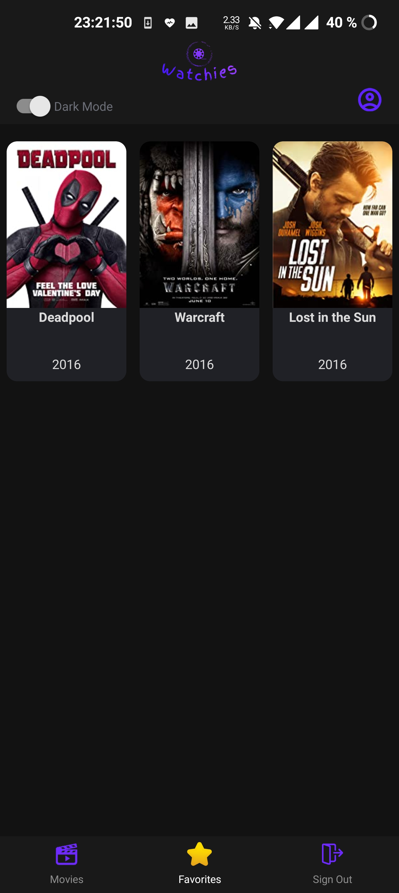
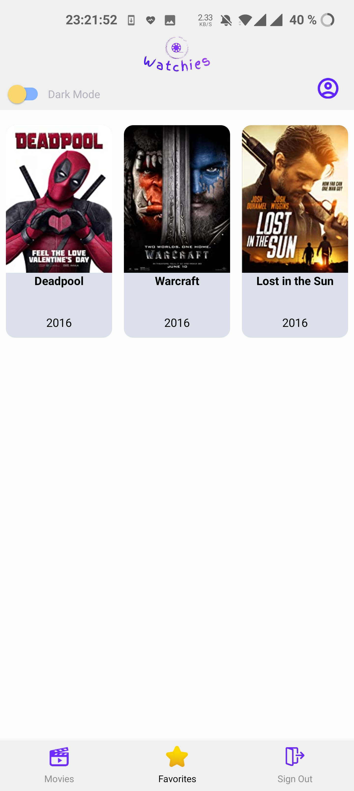
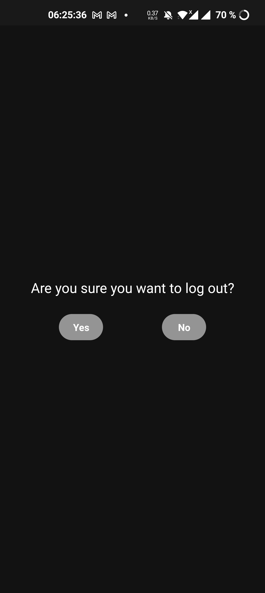
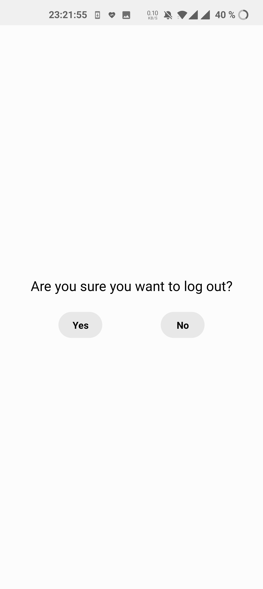

# Watchies

## NB: the application was created to work optimally with android devices
The application was only tested with different android devices. There are differences between Android and iOS regarding the functionality of react native core components and the order of the stacking of components when running the project. 
Therefore, the application has ciritcal bugs affecting some functionalities when ran with iOS.

I would recommend that you try out the application with an Android device or an Android simulator.

### DEMO: If you do not have access to an Android device or Android simulator
I have provided a video demo of the application that showcases all of the availabe funcitonality the way we experienced it on our Android devices.

```bash
https://veed.io/view/d6b55733-b3a7-4bcf-b1cd-e9f740e336aa
```

#### Functionality showcased in the demo:
- Different feedback when signing in and signing up (the email field will also check if "@" and "." is present).
- Creating a user.
- Scrolling in the infinite list.
- Pressing on a movie on the homepage.
- Adding a movie to your favorites list.
- Searching for a movie.
- Feedback when reaching the end of the infinite list.
- Feedback when there is no movies matching the search.
- Filter on genre.
- Sorting on newest first or oldest first.
- Sorting, filter and search dissapears on scroll down and appears on scroll up.
- Users email displayed/hidden at the top right corner.
- Dark mode/light mode.
- View movies added to your favorites list on the favorites page.
- Pressing on a movie on the favorite page.
- Skips login page when previously logged in after completely closing the app.
- Saves the previous dark/light mode settings after completely closing the app.
- Signing out with the Sign out button, confirm the sign out and then get directed to login page instead of homepage when reopening the app.
- Remove a movie from the favorites list on the favorites page.
- Persistent favorites list after signing out and in.

## Run Instructions
1. Check if you have yarn installed:
```bash
yarn --version
```

2. If you get yarn command not found, install yarn:
```bash
npm install --global yarn
```
3. Repeat step 1 to verify that yarn was successfully installed.

4. Install the dependencies inside /watchies:
```bash
yarn install
```

5. Inside /watchies, run the command:
```bash
yarn start
```

6. Download the expo app from google play or app store. 
7. Scan the QR-code. The phone and the computer needs to be connected to the same internet connection. 
8. If it dosent start building in the terminal on the first try, close the app-window on your phone, go back to the expo-app and scan the QR-code again.


If you encounter this error message in the terminal: 
- "apiV2Error: Entity Not Authorized."
Then run the command:
```bash
expo logout
```
Then continue through the remaining steps.

### APK
If you have an android phone and would like to try out the app without the expo app, you can download the apk and install it on your phone from here:
```bash
https://expo.dev/artifacts/eas/6uBVf2RGLnzQNEJEhoCGKc.apk
```
#### Build apk
```bash
yarn eas build -p android --profile preview
```
"Preview" is just the label for this apk build. Can be changed to something else like "development".

## About Watchies 
Watchies is a React Native application. The main functionality of the application is to search through a database consisting of 37000 movies. You are also able to filter and sort the movies, and add movies to the user's favorites list. 

### Login Page
When you open the application you will be directed to the initial page, the login page. Here you can enter your email and password to sign in, or create a new account. The form handles various errors and gives feedback to the user. If you were previously logged in without logging out, then you will be directed directly into movies, skipping the login screen. The last theme (dark/light) setting will also be saved.





### Movie Search Page
After signing in you will be directed to the movie search page. Here you are able to search, filter and sort. The header containing the search bar and drop-downs will dissappear when scrolling downwards and appear when scrolling upwards or when you are at the top. It is not possible to make the header dissappear when the view is above the first row of movie components.





You can click on a movie to view more information as well as adding it to favorites. There is also a button directing you to the IMDB page.





### Favorite Movies Page
On this page you will be able to see all your favorite movies that were previously added.





### Log out
When pressing the log out tab in the navbar you will get a pop up to confirm if you would like to log out or not.





### Dark/Light Mode
On all the pages there is a switch available where you can change the mode between dark and light. Default is dark, but after running the app for the first time, your settings wil be saved.

## Testing
The application was tested with the expo app on android. It was tested with two devices with different aspect ratios:
- OnePlus 9 Pro: aspect ratio 20.1:9
- Huawei P20 Pro: aspect ratio 18.7:9
The application was also tested as an installed apk on the OnePlus devices.
